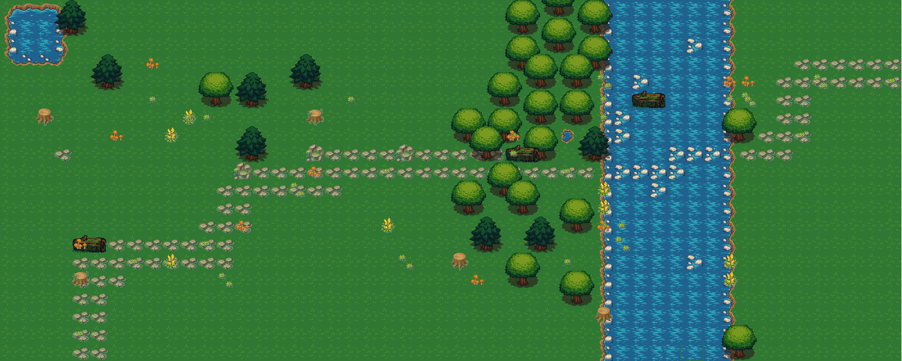
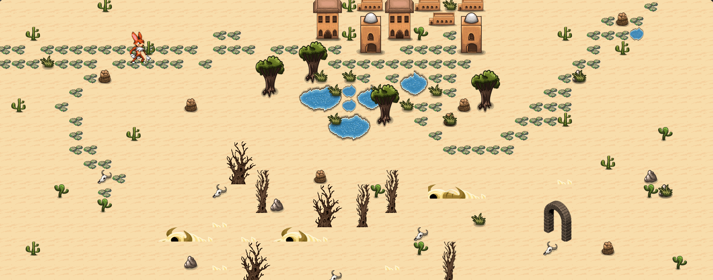
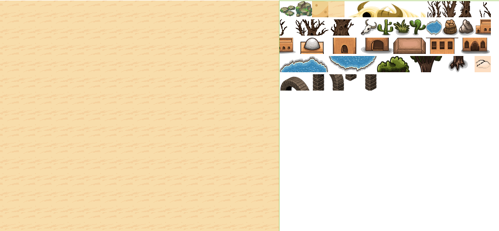

# JOURNEY -  A RPG. 
Journey is a turn based RPG. Movement is controlled through dice rolls. The player starts with food,
water, coins, and health. Each dice roll moves the player forward and counts as a single day of travel. 
Each day the player loses 1 day of food and water. Random events happen along the way; 
robbers may steal your food or coins in the night. Players have the chance to replenish supplies at various stages in the game. Play here -  https://m-spilman.github.io/Journey/

   

### CORE
This game is 100% front end. State management is controlled using React. Everything else is 100% vanilla Javascript and custom CSS. There are no libraries or frameworks. 

# Development. 
### 1.  Game Board. 

  The initial board was built using a matrix grid system and a nested loop. While this was functional in building the board and I had a working proof of concept, I ultimately decided it would be cumbersome to design as detailed a map / board as I envisioned. I felt this was more a role for a Photoshop / Illustrator or something where I could see my product in its entirety as a I worked in realtime. I found this project on git - https://github.com/ReactUniversity/037-building-an-online-rpg-game-part-2
  
  This is an HTML5 drag and drop map builder - in short I could drag and drop tiles onto a blank grid system to build a world - Exactly what I needed. I pulled down various tiles sets from https://opengameart.org/ and mixed and matched to get the look I wanted. I then resized and cut them into 32x32 pixels. I quickly found that sizing each object to 32x32 would not give me the aesthetic I was looking for. This would make your character 32x32 your tree 32x32, your house 32x32, etc. - there was no depth. While each of the tiles in the game are 32x32, many objects are comprised of multiple 32x32 tiles. Some trees and houses are composed of four or five 32x32 tiles. Once this was all sorted. I modified the app I had pulled down from git and replaced the tiles with my own. I then tediously dragged and dropped my ever expanding tile sets into the grid to build the product you see here. 

 

Do not think this was an easy task or done in one shot. I was constantly dragging and dropping deciding the size wasn't right. getting the original tile sets, resizing, cutting, replacing the tiles in my world builder, and starting the drag and drop over. 
  Once I finally had a map completed, at least visually, I had to decided what to do with it - K.I.S.S. Keep it simple stupid. I took a screenshot. I used the image as a background. It would only have to be loaded once, my character could sit on top of it, and I knew moving 1 tile would be 32 pixels. The character could easily be moved using simple CSS.
  
### 2. Logic: Random Events and Designated Areas

Right or wrong, I decided the build arrays that contained all the locations a player could be. A total of four were created, two for each of the two maps, each containing position from top from left respectively. Each dice roll would move the index of the array. I could then write statements like this

if(props.position >= 31 && props.position <=37 && props.map === 'map1') foodSpot = true

If  a player was withing this range of locations AND you were on map 1 then display dialogue - 'Check out that forest! Now might be a good time to see if I can find some food.'

### 3. Structure

Public folder contains various folders for images and fonts - dice, maps, player, etc.
Src folder contains my JS files and a folder, 'Components' which contains the various react components: 'MapComp, 'PlayerComp', 'RollComp' etc.

**Notes:**
The code has few comments. This project was my first dive into React and was completed in 2 or 3 weeks. Despite the lack of internal comments the code should be relatively straight forward as things are named appropriately: 'calculateHealth', 'setFood', 'generateEvents' and so on. I am sure there are mistakes, things that could have been done better. Again, this was my first React project as part of my Digitalcrafts class and once finished, we were moving on to the next project.

